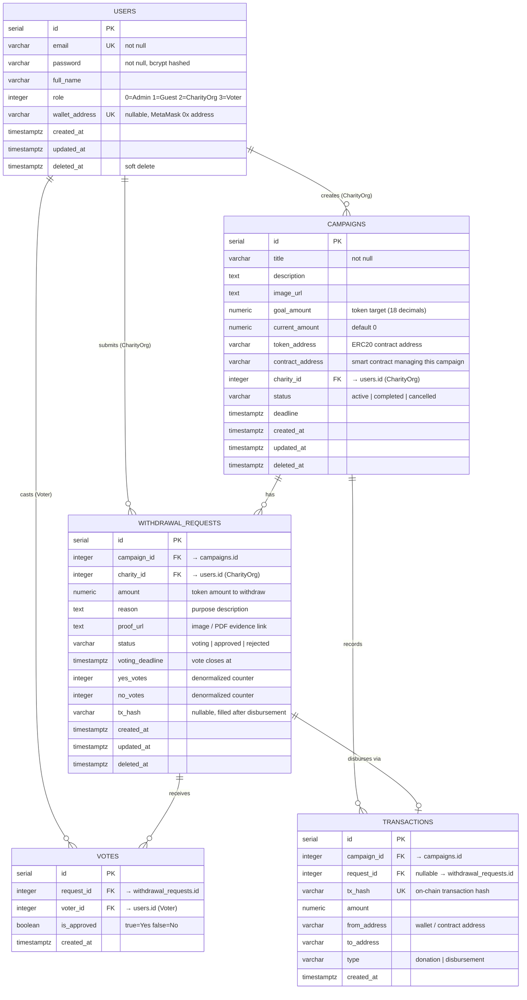
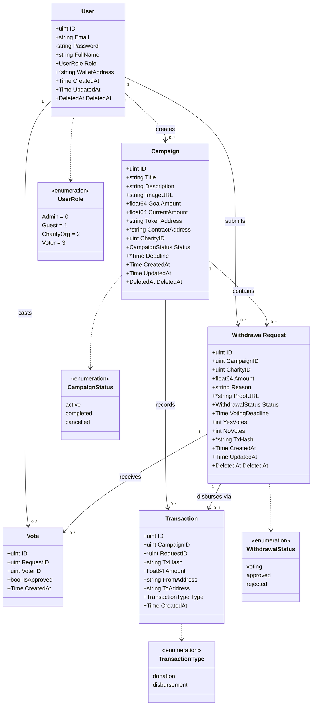

# Charity Chain — Database Design

## ERD (Entity Relationship Diagram)

```mermaid
erDiagram
    USERS {
        serial      id              PK
        varchar     email           UK "not null"
        varchar     password                "not null, bcrypt hashed"
        varchar     full_name
        integer     role                    "0=Admin 1=Guest 2=CharityOrg 3=Voter"
        varchar     wallet_address  UK      "nullable, MetaMask 0x address"
        timestamptz created_at
        timestamptz updated_at
        timestamptz deleted_at              "soft delete"
    }

    CAMPAIGNS {
        serial      id              PK
        varchar     title                   "not null"
        text        description
        text        image_url
        numeric     goal_amount             "token target (18 decimals)"
        numeric     current_amount          "default 0"
        varchar     token_address           "ERC20 contract address"
        varchar     contract_address        "smart contract managing this campaign"
        integer     charity_id      FK      "→ users.id (CharityOrg)"
        varchar     status                  "active | completed | cancelled"
        timestamptz deadline
        timestamptz created_at
        timestamptz updated_at
        timestamptz deleted_at
    }

    WITHDRAWAL_REQUESTS {
        serial      id              PK
        integer     campaign_id     FK      "→ campaigns.id"
        integer     charity_id      FK      "→ users.id (CharityOrg)"
        numeric     amount                  "token amount to withdraw"
        text        reason                  "purpose description"
        text        proof_url               "image / PDF evidence link"
        varchar     status                  "voting | approved | rejected"
        timestamptz voting_deadline         "vote closes at"
        integer     yes_votes               "denormalized counter"
        integer     no_votes                "denormalized counter"
        varchar     tx_hash                 "nullable, filled after disbursement"
        timestamptz created_at
        timestamptz updated_at
        timestamptz deleted_at
    }

    VOTES {
        serial      id              PK
        integer     request_id      FK      "→ withdrawal_requests.id"
        integer     voter_id        FK      "→ users.id (Voter)"
        boolean     is_approved             "true=Yes false=No"
        timestamptz created_at
    }

    TRANSACTIONS {
        serial      id              PK
        integer     campaign_id     FK      "→ campaigns.id"
        integer     request_id      FK      "nullable → withdrawal_requests.id"
        varchar     tx_hash         UK      "on-chain transaction hash"
        numeric     amount
        varchar     from_address            "wallet / contract address"
        varchar     to_address
        varchar     type                    "donation | disbursement"
        timestamptz created_at
    }

    USERS           ||--o{ CAMPAIGNS           : "creates (CharityOrg)"
    USERS           ||--o{ WITHDRAWAL_REQUESTS : "submits (CharityOrg)"
    USERS           ||--o{ VOTES               : "casts (Voter)"
    CAMPAIGNS       ||--o{ WITHDRAWAL_REQUESTS : "has"
    CAMPAIGNS       ||--o{ TRANSACTIONS        : "records"
    WITHDRAWAL_REQUESTS ||--o{ VOTES           : "receives"
    WITHDRAWAL_REQUESTS ||--o| TRANSACTIONS    : "disburses via"
```

---

## Class Diagram

```mermaid
classDiagram
    class User {
        +uint   ID
        +string Email
        -string Password
        +string FullName
        +UserRole Role
        +*string WalletAddress
        +Time   CreatedAt
        +Time   UpdatedAt
        +DeletedAt DeletedAt
    }

    class Campaign {
        +uint       ID
        +string     Title
        +string     Description
        +string     ImageURL
        +float64    GoalAmount
        +float64    CurrentAmount
        +string     TokenAddress
        +*string    ContractAddress
        +uint       CharityID
        +CampaignStatus Status
        +*Time      Deadline
        +Time       CreatedAt
        +Time       UpdatedAt
        +DeletedAt  DeletedAt
    }

    class WithdrawalRequest {
        +uint       ID
        +uint       CampaignID
        +uint       CharityID
        +float64    Amount
        +string     Reason
        +*string    ProofURL
        +WithdrawalStatus Status
        +Time       VotingDeadline
        +int        YesVotes
        +int        NoVotes
        +*string    TxHash
        +Time       CreatedAt
        +Time       UpdatedAt
        +DeletedAt  DeletedAt
    }

    class Vote {
        +uint    ID
        +uint    RequestID
        +uint    VoterID
        +bool    IsApproved
        +Time    CreatedAt
    }

    class Transaction {
        +uint    ID
        +uint    CampaignID
        +*uint   RequestID
        +string  TxHash
        +float64 Amount
        +string  FromAddress
        +string  ToAddress
        +TransactionType Type
        +Time    CreatedAt
    }

    class UserRole {
        <<enumeration>>
        Admin = 0
        Guest = 1
        CharityOrg = 2
        Voter = 3
    }

    class CampaignStatus {
        <<enumeration>>
        active
        completed
        cancelled
    }

    class WithdrawalStatus {
        <<enumeration>>
        voting
        approved
        rejected
    }

    class TransactionType {
        <<enumeration>>
        donation
        disbursement
    }

    User "1" --> "0..*" Campaign           : creates
    User "1" --> "0..*" WithdrawalRequest  : submits
    User "1" --> "0..*" Vote               : casts
    Campaign "1" --> "0..*" WithdrawalRequest : contains
    Campaign "1" --> "0..*" Transaction       : records
    WithdrawalRequest "1" --> "0..*" Vote     : receives
    WithdrawalRequest "1" --> "0..1" Transaction : disburses via
    User ..> UserRole
    Campaign ..> CampaignStatus
    WithdrawalRequest ..> WithdrawalStatus
    Transaction ..> TransactionType
```
